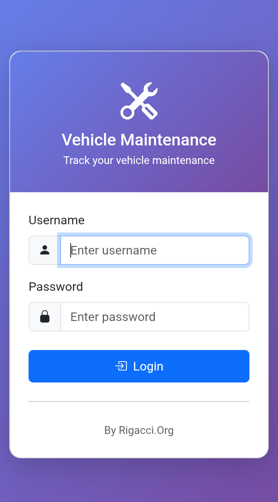
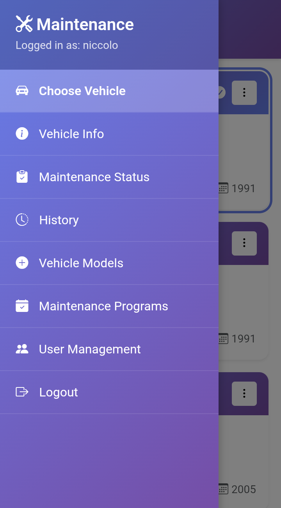
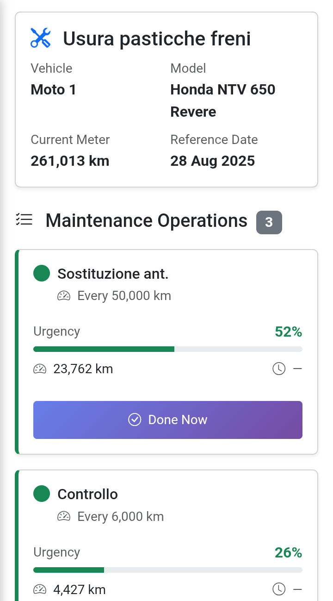
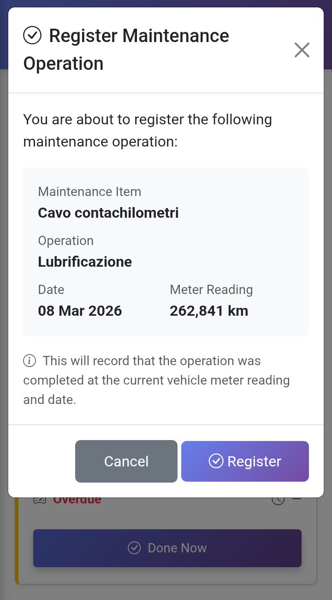
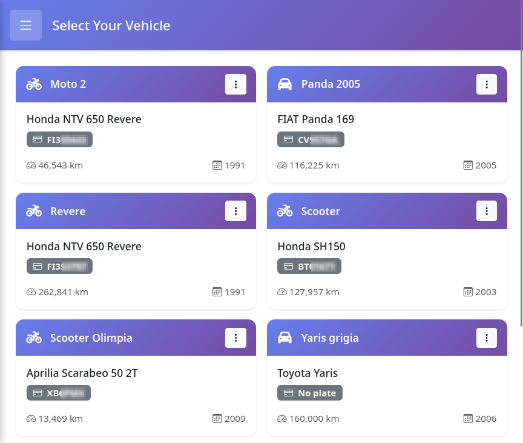
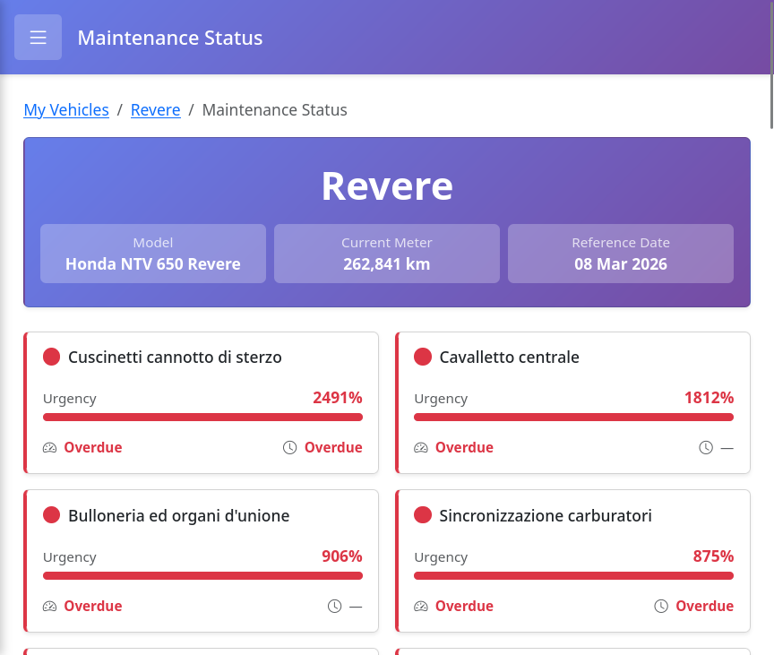
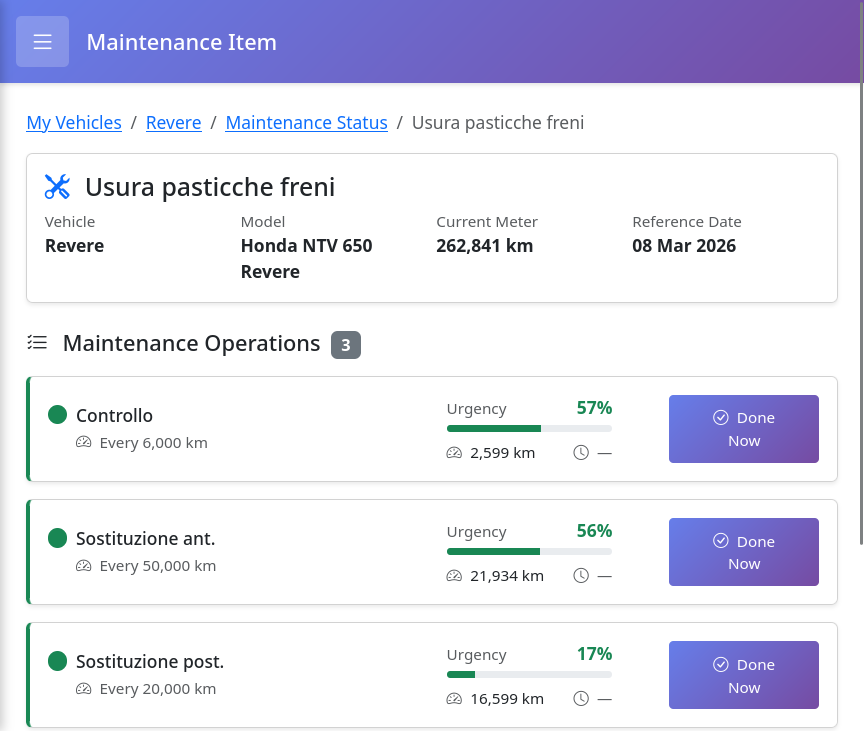

# Vehicle Maintenance Tracker

A web-based maintenance tracking system for vehicles and 
equipment. Set service intervals by distance or time, monitor 
maintenance alerts, and maintain complete service history with 
notes.


## Features

### Vehicle Management
- **Multi-vehicle support** - Track cars, motorcycles, trucks, boats, and equipment
- **Vehicle profiles** - Store nickname, license plate, VIN, and vehicle-specific notes
- **Flexible models** - Define reusable vehicle models with custom maintenance programs

### Maintenance Tracking
- **Dual-interval monitoring** - Track by odometer/hour meter AND calendar time
- **Custom maintenance programs** - Define maintenance items and operations per vehicle model
- **Urgency calculations** - Visual indicators (green/yellow/red) show maintenance priority
- **Quick registration** - One-click operation logging with automatic timestamp
- **Complete history** - Full maintenance log with dates, meter readings, and notes

### User Features
- **Multi-user support** - Separate accounts with role-based access (admin/user)
- **Search functionality** - Quick search in maintenance history and notes
- **Responsive design** - Works on desktop, tablet, and mobile devices
- **Intuitive interface** - Bootstrap 5 UI with color-coded status indicators

### Data Management
- **Timestamped notes** - Log observations and issues with date and meter reading
- **Flexible units** - Support for kilometers, miles, hours, and custom units
- **Time intervals** - Define intervals in days, weeks, months, or years
- **Data integrity** - Unique constraints prevent duplicate entries

## Screenshots

### Mobile View

<table>
  <tr>
    <td width="25%">
      
      <p align="center"><b>Login Screen</b></p>
    </td>
    <td width="25%">
      
      <p align="center"><b>Main Menu</b></p>
    </td>
    <td width="25%">
      
      <p align="center"><b>Operations</b></p>
    </td>
    <td width="25%">
      
      <p align="center"><b>Register Operation</b></p>
    </td>
  </tr>
</table>

### Desktop View

<table>
  <tr>
    <td width="33%">
      
      <p align="center"><b>Vehicle Selection</b></p>
    </td>
    <td width="33%">
      
      <p align="center"><b>Maintenance Status</b></p>
    </td>
    <td width="33%">
      
      <p align="center"><b>Maintenance Item</b></p>
    </td>
  </tr>
</table>


## Requirements

- **Web Server** - Apache or Nginx with PHP support
- **PHP** - Version 7.4 or higher
- **Database** - PostgreSQL 12+, MySQL 5.7+ or SQLite3
- **PHP Extensions** - PDO, pdo_pgsql (or pdo_mysql or pdo_sqlite3), session, mbstring

## Installation

### 1. Clone the Repository

```bash
git clone https://github.com/RigacciOrg/maintenance-tracker.git
cd maintenance-tracker
```

### 2. Configure Web Server

Copy all files to your web server's document root or a subdirectory:

```bash
# Example for Apache on Ubuntu/Debian
sudo mkdir -p /var/www/html/maintenance-tracker
sudo cp -r * /var/www/html/maintenance-tracker/
```

### 3. Create Database

**For PostgreSQL:**

```bash
# Create database
sudo -u postgres createdb maintenance_tracker

# Create user
sudo -u postgres psql
postgres=# CREATE USER maintenance_user WITH PASSWORD 'your_password';
postgres=# GRANT ALL PRIVILEGES ON DATABASE maintenance_tracker TO maintenance_user;
postgres=# \q
```

**For MySQL:**

```bash
mysql -u root -p
mysql> CREATE DATABASE maintenance_tracker;
mysql> CREATE USER 'maintenance_user'@'localhost' IDENTIFIED BY 'your_password';
mysql> GRANT ALL PRIVILEGES ON maintenance_tracker.* TO 'maintenance_user'@'localhost';
mysql> FLUSH PRIVILEGES;
mysql> EXIT;
```

### 4. Initialize Database Schema

**For PostgreSQL:**

```bash
psql -U maintenance_user -d maintenance_tracker -f database-pgsql.sql
```

**For MySQL:**

```bash
mysql -u maintenance_user -p maintenance_tracker < database-mysql.sql
```

**For SQLite:**

```bash
sqlite3 maintenance_tracker.db < database-sqlite.sql
chmod 664 maintenance_tracker.db
chown www-data:www-data maintenance_tracker.db
```

### 5. Configure Database Connection

Edit `config/database.php` and update the connection settings:

**For PostgreSQL:**

```php
define('DB_TYPE', 'pgsql');
define('DB_HOST', 'localhost');
define('DB_NAME', 'maintenance_tracker');
define('DB_USER', 'maintenance_user');
define('DB_PASS', 'your_password');
```

**For MySQL:**

```php
define('DB_TYPE', 'mysql');
define('DB_HOST', 'localhost');
define('DB_NAME', 'maintenance_tracker');
define('DB_USER', 'maintenance_user');
define('DB_PASS', 'your_password');
```

**For SQLite:**

```php
define('DB_TYPE', 'sqlite');
define('DB_SQLITE_FILE', __DIR__ . '/../db/maintenance_tracker.db');
```

### 6. Important: Protect SQLite Database File

**If you're using SQLite**, the database file 
(`maintenance_tracker.db`) must be protected from direct web 
access to prevent unauthorized downloads.

#### Option 1: Place Database Outside Web Root (Recommended)

Store the database file **outside** your web-accessible 
directory:
```
/var/www/
├── html/                          ← Web root
│   └── maintenance-tracker/
│       ├── config/
│       ├── includes/
│       └── index.php
└── data/
    └── maintenance_tracker.db     ← Database here (not accessible via web)
```
Update `config/database.php`:
```php
define('DB_SQLITE_FILE', '/var/www/data/maintenance_tracker.db');
```

#### Option 2: Use .htaccess to Block Access

If you must keep the database in the web root, create a 
`.htaccess` file in your project root:

**For Apache:**
```apache
# .htaccess
<Files "*.db">
    Require all denied
</Files>
```

**For Nginx:**

Add to your server configuration:
```nginx
location ~* \.db$ {
    deny all;
}
```

### 7. Initial Admin User

The database initialization script, based on the provided SQL 
schema, creates a default admin user with the password 
``password``. **This password must be changed immediately after 
the first login**.

### 8. Access the Application

Open your browser and navigate to:

```
http://localhost/maintenance-tracker/
```

**Default credentials:**
- Username: `demo`
- Password: `password`

**⚠️ Important:** Change the default password immediately after first login via User Management → My Account.

## Usage

### Quick Start Guide

1. **Login** with your credentials
2. **Add a Vehicle Model** (Maintenance Program → Vehicle Models)
   - Define manufacturer, model name, vehicle type
   - Set meter unit (km, miles, hours) and time unit (days)
3. **Create Maintenance Program** (Maintenance Program → Maintenance Operations)
   - Add maintenance items (e.g., "Engine Oil", "Brake System")
   - Define operations with intervals (e.g., "Change Oil" every 10,000 km or 365 days)
4. **Add Your Vehicle** (My Vehicles → Add Vehicle)
   - Select the vehicle model
   - Enter nickname, license plate, VIN
   - Set current meter reading and date
5. **Monitor Maintenance Status**
   - View color-coded urgency indicators
   - Click "Done Now" to quickly log completed operations
6. **Track History**
   - View complete maintenance history
   - Add timestamped notes for observations
   - Search through records

### User Roles

**Regular User:**
- Create/edit/delete vehicle models
- Define maintenance programs with items and operations
- Create/manage own vehicles
- Track maintenance and history
- Change own password and email

**Administrator:**
- Manage users
- Full access to all features

## Database Schema

The application uses the following main tables:

- `users` - User accounts and authentication
- `vehicle_models` - Reusable vehicle model definitions
- `maintenance_items` - Maintenance categories (e.g., Engine, Brakes)
- `maintenance_operations` - Specific operations with intervals
- `vehicles` - User's vehicles
- `maintenance_history` - Service records
- `vehicle_notes` - Timestamped observations

See `database-*.sql` for complete schema definition.

### Key Features of the Schema

- **Cascading deletes**: Deleting a user removes all their vehicles, models,
and history
- **Unique constraints**: Prevents duplicate models, items, and operations
- **Data validation**: CHECK constraints on unit types ensure data integrity
- **Flexible intervals**: Support both time-based (days) and distance-based
(km/miles) maintenance
- **Audit trail**: All tables include `created_at` timestamp

## Security

- Passwords hashed with `PASSWORD_DEFAULT` (bcrypt)
- Session-based authentication
- Input validation and sanitization
- PDO prepared statements (SQL injection protection)
- CSRF protection via server-side validation
- Access control on all pages

## Configuration

### Session Settings

Edit `includes/auth.php` to adjust session timeout:

```php
ini_set('session.gc_maxlifetime', 3600); // 1 hour
```

### Pagination

Adjust records per page in list views by modifying the respective PHP files.

### Time Conversion

Time intervals are stored in days. Conversion factors in `maintenance-operations.php`:

- 1 week = 7 days
- 1 month = 30 days
- 1 year = 365 days

## Troubleshooting

### Database Connection Error

Check `config/database.php` settings and ensure:
- Database exists
- User has proper privileges
- Host/port are correct
- PDO extension is installed

### Session Issues

Ensure PHP session directory is writable:

```bash
sudo chmod 1777 /var/lib/php/sessions
```

### Permission Denied

Set proper file permissions:

```bash
sudo chown -R www-data:www-data /var/www/html/maintenance-tracker/
sudo chmod -R 755 /var/www/html/maintenance-tracker/
```

## Development

### Adding New Features

The codebase follows a simple MVC-like structure:

- `includes/` - Reusable components (header, footer, auth)
- `config/` - Database configuration
- `*.php` - Page controllers (handle logic and display)

### Code Style

- Use prepared statements for all database queries
- Validate and sanitize all user input
- Follow existing naming conventions
- Add comments for complex logic

## Contributing

Contributions are welcome! Please:

1. Fork the repository
2. Create a feature branch (`git checkout -b feature/amazing-feature`)
3. Commit your changes (`git commit -m 'Add amazing feature'`)
4. Push to the branch (`git push origin feature/amazing-feature`)
5. Open a Pull Request

Please ensure your code follows the existing style and includes appropriate comments.

## License

This project is licensed under the GNU Affero General Public License v3.0 (AGPL-3.0) - see the [LICENSE](LICENSE) file for details.

This means:
- ✅ Free to use, modify, and distribute
- ✅ Modifications must remain open source
- ✅ If you run this as a web service, you must provide source code to users
- ✅ Attribution required

## Third-Party Libraries Included

This repository includes the following third-party libraries:

- Bootstrap 5.3.8 - MIT License
- Bootstrap Icons 1.13.1 - MIT License
- Font Awesome Free 7.2.0 - Font Awesome Free License

See respective LICENSE files in the `vendor/` directory.

## Support

For issues, questions, or feature requests, please open an issue on GitHub.

## Acknowledgments

- Built with [Bootstrap 5](https://getbootstrap.com/)
- Icons by [Bootstrap Icons](https://icons.getbootstrap.com/)
- PHP PDO for database abstraction

## Roadmap

- [ ] Import/export maintenance history and programs (CSV, JSON)
- [ ] Email notifications for upcoming maintenance
- [ ] Multi-language support
- [ ] REST API for external integrations
- [ ] Document attachments (receipts, invoices)

---

**Made with ❤️ for vehicle enthusiasts and fleet managers**
